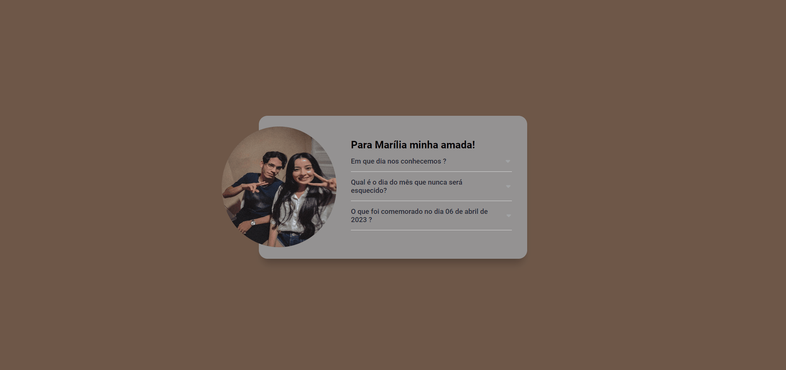

# Desafio Curso DevQuest | Criando um acordeon

## Tabela do Conteudo

<ul>
<li><a href="#sobre">Sobre</a></li>
<li><a href="#status">Status</a></li>
<li><a href="#desafio">Desafio</a></li>
<li><a href="#curiosidade">Curiosidade</a></li>
<li><a href="#tecnologias">Tecnologias</a></li>
<li><a href="#acessando-o-site">Acessando o site</a></li>
</ul>

## Sobre

### Layout Desktop.

Estou muito feliz por ter chegado até aqui, consegui resolver esse desafio em pouco tempo de JavaScript, graças ao curso DevQuest - Dev em Dobro, que depois de uma aula em específico, ampliou meu raciocínio. 

## Status

Concluído apenas para Desktops! 👌

## Desafio

O desafio consiste em ao clicar em uma pergunta deve acontecer uma animação de acordeon mostrando o texto e alterando a cor da seta e caso o outro texto esteja aberto, feche automaticamente.

## Curiosidade

Após finalizar o desafio proposto, decidi mudar a temática fazendo uma surpresa para minha namorada.
Antes de olhar qualquer resolução desse exercício, fiz minha primeira solução para resolver esse problema.

## Tecnologias

<ul>
<li>HTML</li>
<li>CSS</li>
<li>JavaScript</li>
<li>GIT BASH</li>
</ul>

## Acessando o site

Para acessar a página, por favor use esse link : <a href="https://tiago-forward.github.io/desafio-acordeon-devquest/" target="_blank">Desafio Curso DevQuest | Criando um acordeon</a>